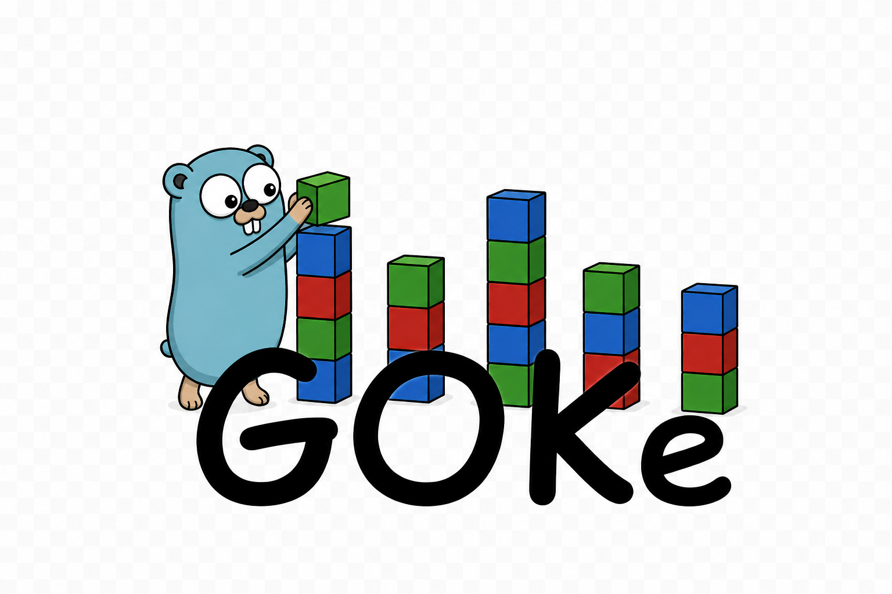

# GOKe

<p align="center">
  
  <br>
  <a href="https://go.dev">
    
  </a>
  <a href="https://pkg.go.dev/github.com/kjkrol/goke/v3">
    
  </a>
  <a href="https://opensource.org/licenses/MIT">
    
  </a>
  <a href="https://goreportcard.com/report/github.com/kjkrol/goke">
    
  </a>
  <a href="https://app.codecov.io/gh/kjkrol/goke">
    
  </a>
  <a href="https://github.com/kjkrol/goke/actions">
    
  </a>
  <a href="https://github.com/avelino/awesome-go">
    
  </a>
</p>

**GOKe** is a type-safe, archetype-based [Entity Component System](https://en.wikipedia.org/wiki/Entity_component_system) (ECS) for [Go](https://go.dev/). It uses a **Structure of Arrays (SoA)** storage model and Data-Oriented Design principles to enable cache-friendly iteration and efficient processing of large numbers of entities.

<p align="center">
    <a href="#features">Features</a>
    &nbsp;&bull;&nbsp;
    <a href="#installation">Installation</a> 
    &nbsp;&bull;&nbsp;
    <a href="BENCHMARKS.md">Benchmarks</a>
    &nbsp;&bull;&nbsp;
    <a href="#performance">Performance</a>
    &nbsp;&bull;&nbsp; 
    <a href="#example">Example</a>
    &nbsp;&bull;&nbsp; 
    <a href="#architecture">Architecture</a>
    &nbsp;&bull;&nbsp; 
    <a href="#roadmap">Roadmap</a>
    &nbsp;&bull;&nbsp; 
    <a href="#documentation">Documentation</a>
</p>

# Design Goals

GOKe is primarily an ECS for game development, but its archetype-based
SoA architecture also makes it well suited for simulations, AI agents,
real-time analytics, and other performance-critical workloads.

The project is built around a few core principles:

- Abstractions that reflect ideas, not implementation details
- Predictable performance with no hidden costs
- Cache-friendly data layouts
- Zero-allocation hot paths
- Inlining-friendly hot paths
- Type-safe APIs without reflection
- Native Go development without CGO dependencies

While native C and Rust ECS frameworks may achieve higher peak throughput,
GOKe is designed to maximize performance within the Go ecosystem. For many
projects, **avoiding CGO boundaries**, external dependencies, and cross-language
integration costs can outweigh the gains of a faster foreign implementation.

<a id="installation"></a>
# 📦 Installation

GOKe requires **Go 1.27.0** or newer.

```bash
go get github.com/kjkrol/goke/v3
```

<a id="features"></a>

# ✨ Key Features

| Capability | How |
|:---|:---|
| **Zero-allocation hot paths** | Chunk-based SoA layout with direct pointer arithmetic — no GC pressure during iteration or component access |
| **Predictable iteration speed** | Linear SoA memory access — cache-friendly, branch-free inner loops; sub-nanosecond per entity at scale |
| **Predictable iteration cost** | Per-entity overhead stays constant regardless of how much logic runs in the loop body |
| **O(1) component lookup** | Entity-to-storage is a direct array index, not a hash map — constant time at any world size |
| **Safe entity recycling** | 64-bit generational IDs detect stale references after deletion, preventing ABA bugs |
| **Cache-friendly storage** | Contiguous SoA chunks; growth appends new chunks, removal uses swap-and-pop — no fragmentation |
| **Batch entity creation** | `Factory` writes components directly into chunk-shaped batches — no per-entity allocation |
| **Type-safe component API** | Fully generic — no reflection, no interface boxing, no runtime type assertions |
| **Built-in scheduler** | Declarative `Plan` wires systems into an execution graph — a full ECS runtime, not just a component store |
| **Command Buffer** | Structural changes during iteration are queued and flushed at explicit `Sync()` points — enables safe `RunParallel` |
| **Bulk operations** | `Editor`/`ValueEditor`/`Remover`, staged via `Query.BeginMigrate`/`Add`/`Commit`, batch add/remove-component and remove-entity changes for entities matched by a `Query` — one block memory copy per contiguous run instead of a move per entity |
| **Single-entity operations** | `CmdBuf.AddOne`/`RemoveOne`/`RemoveCompOne` edit or remove one entity reached without iterating a `Query` (an external event, a saved id) — the complement to bulk operations, not a substitute for them inside a `Query` loop |
| **World persistence** | Save the whole world's state to a file and restore it exactly: every registered component type, the archetypes entities are grouped into, and each entity's own identity. |
| **Module composition** | Package a coherent set of components and systems as one self-contained `Module` — a game wires it up without knowing its internals, and can plug it into its own one-time `Setup` (world seeding) or per-tick `Plan` (simulation) |

> 💡 **See the Performance & Scalability section below for benchmark results validated from 2¹⁰ to 2²⁰ entities.**

<a id="performance"></a>
# ⏱️ Performance & Scalability
GOKe is designed for predictable performance at scale. By utilizing a **Centralized Record System** (dense array lookup) instead of traditional hash maps, structural operations and query execution remain effectively independent of the total entity count ($N$).

## 📊 Cross-framework comparison
Benchmarks against other Go ECS libraries (Arche, Donburi, Ento, etc.) are maintained in a dedicated project — [**go-ecs-benchmarks**](https://github.com/mlange-42/go-ecs-benchmarks) by [@mlange-42](https://github.com/mlange-42). 

⚠️ Before drawing conclusions, verify which GOKe version (tag) is used in the comparison, as published results may lag behind the latest release.

## Scalability Validation
Benchmarked at a population of **1,024** entities (**100,000** for `Remove Entity`) on an **Intel i5-8265U** (see [BENCHMARKS.md](./BENCHMARKS.md#environment)). Structural operations (`Editor`/`ValueEditor`/`Remover`) stay in the tens-of-ns/entity range regardless of how many components an edit touches; query paths (`Query.All`/`Pick`/`Seek`/`SeekH`) report zero allocations across every component count tested.

| Category | Operation | Observed Cost | Allocs | Technical Mechanism |
| :--- | :--- | :--- | :--- | :--- |
| **Throughput** | **Iteration (Query.All)** | **0.39 - 4.18 ns/ent** | **0** | Linear SoA (0-10 components) |
| **Subset Query** | **Pick (per-entity)** | **5.8 - 19.0 ns/ent** | **0** | Per-entity record lookup + pointer math |
| **Direct Access** | **Seek (single entity)** | **4.4 - 18.7 ns/ent** | **0** | Index lookup, independent of include/exclude mask |
| **Direct Access** | **SeekH (homogeneous, cached archetype)** | **2.2 - 16.2 ns/ent** | **0** | Skips generation/mask checks after a prior Seek |
| **Structural** | **Batch Create** | **8.0 - 18.8 ns/ent** | 0-1 | Factory-based chunk writes |
| **Structural** | **Add Component** | **5.9 - 18.7 ns/ent** | 0 (grows past N=8) | Archetype migration (1 → 1+N components) |
| **Structural** | **Add Tag** | **5.6 - 12.9 ns/ent** | **0** | Archetype migration (zero-size component) |
| **Structural** | **Remove Component** | **14.1 - 19.4 ns/ent** | 0 (grows at N=1) | Archetype migration (10 → 10-N components) |
| **Structural** | **Add Component + Value (ValueEditor)** | **6.2 - 43.7 ns/ent** | **0** | Archetype migration + per-entity value write |
| **Structural** | **Bulk Remove (Remover)** | **14.4 - 86.2 ns/ent** | **0** | `CmdBuf`-batched migration, one `Sync` per chunk |
| **Structural** | **Remove Entity** | **101.7 ns/op** (population 100,000) | **0** | Swap-and-pop + index recycling |

> **Deep Dive**: For the full per-component-count breakdown, methodology, and reproduction instructions, see [**BENCHMARKS.md**](./BENCHMARKS.md).

### Reproducing Results

Run the benchmark suite on your own hardware:

```bash
make bench
```

# Real-World Example

The following demo showcases a simple collision simulation built with GOKe and Ebitengine, via
the [**gokebiten**](https://github.com/kjkrol/gokebiten) companion repository.

It simulates thousands of moving AABBs while maintaining a fixed 120 TPS update loop using archetype-based storage, cache-friendly iteration, and parallel systems.

<table>
  <thead>
    <tr>
      <th style="text-align: left; vertical-align: top; width: 400px;">
        <video src="https://github.com/user-attachments/assets/2b921500-eb3e-49bf-98ee-ac741746e64d" width="400" autoplay loop muted playsinline></video>
        <br>
          <sub><strong>Stats:</strong> 2306 colliding AABBs | 120 TPS | 50 collisions/tick</sub>
      </th>
      <th style="text-align: left; vertical-align: top; width: 400px;">
        <video src="https://github.com/user-attachments/assets/50695c5a-4f77-4352-87da-1fa13168415b" width="400" autoplay loop muted playsinline></video>
        <br>
        <sub><strong>Stats:</strong> 524 colliding AABBs | 120 TPS | 15 collisions/tick</sub>
      </th>
    </tr>
  </thead>
</table>

> Source code: [gokebiten/examples/collision-demo](https://github.com/kjkrol/gokebiten/tree/main/examples/collision-demo)

<a id="example"></a>
# Example
> **New to ECS?** Check out the [**Getting Started with GOKe**](https://github.com/kjkrol/goke/wiki/Getting-Started-with-GOKe) guide for a step-by-step deep dive into building your first simulation.

```go
package main

import (
	"fmt"
	"time"

	"github.com/kjkrol/goke/v3"
	"github.com/kjkrol/uid"
)

type Pos struct{ X, Y float32 }
type Vel struct{ X, Y float32 }
type Acc struct{ X, Y float32 }

func main() {
	// Initialize the ECS world.
	ecs := goke.New()

	// Comp[T] gives typed read/write access to a component. The same
	// instance can be reused across factory, editor and query — pass &comp
	// directly, no wrapping.
	var pos goke.Comp[Pos]
	var vel goke.Comp[Vel]
	var acc goke.Comp[Acc]
	var entityID uid.UID64

	// Query/Editor/Factory can only be constructed inside a System's Init —
	// ecs.Setup runs one-off systems for world seeding, exactly once.
	ecs.Setup(goke.SystemFn{
		OnInit: func(si *goke.SysInit) {
			factory := si.NewFactory(&pos, &vel, &acc)
			cursor := &factory.Cursor

			factory.Create(1)
			factory.Next()
			entityID = factory.IDs[0]
			pos.Slice(cursor)[0] = Pos{X: 0, Y: 0}
			vel.Slice(cursor)[0] = Vel{X: 1, Y: 1}
			acc.Slice(cursor)[0] = Acc{X: 0.1, Y: 0.1}
		},
	})

	// Register the movement system: builds its own Query in Init, iterates in Update.
	var query *goke.Query
	movementSystem := ecs.RegSys(goke.SystemFn{
		OnInit: func(si *goke.SysInit) {
			query = si.NewQueryBuilder(&pos, &vel, &acc).Build()
		},
		OnUpdate: func(_ *goke.CmdBuf, _ time.Duration) {
			// SoA layout: Query.All advances chunk by chunk — the inner loop
			// iterates over contiguous memory for cache-friendly access.
			cursor := query.Cursor()
			query.All()
			for query.Next() {
				posSlice := pos.Slice(cursor)
				velSlice := vel.Slice(cursor)
				accSlice := acc.Slice(cursor)
				for i := range cursor.IDs {
					velSlice[i].X += accSlice[i].X
					velSlice[i].Y += accSlice[i].Y
					posSlice[i].X += velSlice[i].X
					posSlice[i].Y += velSlice[i].Y
				}
			}
		},
	})

	// Register the report system: reads and prints, same pattern as
	// movementSystem — reads flow through systems too, not raw lookups
	// pulled out of the ECS.
	var reportQuery *goke.Query
	reportSystem := ecs.RegSys(goke.SystemFn{
		OnInit: func(si *goke.SysInit) {
			reportQuery = si.NewQueryBuilder(&pos).Build()
		},
		OnUpdate: func(_ *goke.CmdBuf, _ time.Duration) {
			if reportQuery.Seek(entityID) {
				p := pos.At(reportQuery.Cursor())
				fmt.Printf("Final Position: {X: %.2f, Y: %.2f}\n", p.X, p.Y)
			}
		},
	})

	// Configure the execution plan and synchronization points.
	ecs.SetPlan(func(ctx goke.RunCtx, d time.Duration) {
		ctx.Run(movementSystem, d)
		ctx.Sync()
		ctx.Run(reportSystem, d)
	})

	// Execute a single simulation step (120 TPS).
	ecs.Tick(time.Second / 120)
}
```

Check the [**examples/**](./examples) directory for complete, ready-to-run projects.

<a id="architecture"></a>
# Architecture

GOKe is an archetype-based ECS built around data-oriented design principles. The internal packages each own a single, well-defined responsibility:

| Package | Responsibility |
|:---|:---|
| [`github.com/kjkrol/uid`](https://pkg.go.dev/github.com/kjkrol/uid) | 64-bit generational entity identifiers — safe index recycling, ABA prevention |
| [`iter`](iter/doc.go) | Lowest-level column-access primitives — `Cursor` (current iteration position) and `ArrayRef[T]` (typed pointer arithmetic into a Cursor, zero-allocation `Slice`/`At`); the public `Comp[T]` wraps this |
| [`internal/comp`](internal/comp/doc.go) | Shared component primitives used across all internal packages — type registration, metadata, and blueprint definitions |
| [`internal/chunk`](internal/chunk/doc.go) | Cache-aligned chunked memory layout — L1-cache-sized fixed slabs, field offset calculation, slot tracking within a growing slab collection; keeps one spare slab on shrink so repeated grow/shrink cycles stay allocation-free |
| [`internal/colstore`](internal/colstore/doc.go) | Column-oriented storage for a single archetype — manages component columns over `chunk.Pack` chunks, resolves component IDs to memory locations in O(1) |
| [`internal/arch`](internal/arch/doc.go) | Archetype identity, archetype graph, and SoA table storage — creates archetypes on demand and caches structural transitions as graph edges |
| [`internal/addr`](internal/addr/doc.go) | Entity address book — manages entity ID lifecycle (uid pool) and maps each ID to its current storage address (`Entry`) via a flat index in O(1); generation check guards against stale references |
| [`internal/bulk`](internal/bulk/doc.go) | Bulk-operation contract — `ChunkSnapshot` (point-in-time chunk address, guarded by the source table's structural version) and the `Migrator`/`ValueMigrator` interfaces; the shared vocabulary of chunk-level batch commands |
| [`internal/ent`](internal/ent/doc.go) | Entity lifecycle — delegates ID allocation and address tracking to `addr.Book`, manages batch entity creation via `Factory`, and bulk archetype migration via `Editor` (add/remove component spec), `Remover` (bulk unlink), and `ValueEditor` (add one component and write a caller-supplied per-entity value into it) |
| [`internal/query`](internal/query/doc.go) | Query layer: `Matcher` bakes component masks into precomputed per-archetype offsets, enabling zero-allocation bulk iteration (`All`), per-entity subset iteration (`Pick`), and O(1) single-entity access (`Seek`) |
| [`internal/persist`](internal/persist/doc.go) | World snapshot encoding — `Save`/`Load` a gzip-wrapped file format covering component definitions, archetype layout, entity data, and the entity ID pool state |
| [`internal/orch`](internal/orch/doc.go) | Plan-based task orchestrator: sequential/parallel execution, deferred mutations via command buffers |
| [`internal/reg`](internal/reg/doc.go) | Top-level world registry — wires together all subsystems and exposes the unified API for entity and component management |
| [`goke`](doc.go) (public) | The package you import. `ECS` wires `reg.Registry` + `orch.Scheduler`; `Comp[T]` gives typed access to a component. Construction is gated through systems: `SysInit` (available in a `System`'s `Init`, or via `ecs.Setup` for one-off world seeding) is the only way to get a `Query` or `Factory`; `Editor`/`ValueEditor` are then built from that `Query`. `System`/`SystemFn`/`CmdBuf` round out the scheduling API |

<a id="roadmap"></a>
# 🗺️ Roadmap
Current development focus and planned improvements:

* **Entity Relations via Tags:** Extend the Tag system to model relationships between entities (parent-child, links, ownership, ...) — adding relational semantics on top of the existing archetype-mask machinery, without sacrificing the zero-allocation hot loop.

> **Live Feature Tracker**
> We manage our long-term goals through GitHub Issues. View all planned core engine expansions and functional capabilities here:
> [**Explore all Pending Features ↗**](https://github.com/kjkrol/goke/issues?q=state%3Aopen%20label%3Afeature)

# When NOT to Use GOKe
GOKe is optimized for large-scale, data-oriented workloads. It may not be the best fit for every project.

* **Small Data Sets** — For a few hundred objects, plain Go structs and slices are often simpler and sufficiently fast.
* **Deep Hierarchies** — ECS excels at flat data layouts. Tree-oriented domains such as UI systems or DOM-like structures may be better served by traditional object graphs.
* **High Structural Churn** — Archetype migration is efficient, but workloads that continuously add and remove components from large numbers of entities every frame may reduce the benefits of archetype-based storage.
* **Behavior-Centric Designs** — If your application is primarily organized around objects and methods rather than data transformations, an ECS may introduce unnecessary complexity.

# Limitations

* **Maximum component types: 128 by default.** The archetype system uses a fixed-size bitmask (`[2]uint64`) for fast component membership checks. Projects requiring more component types can increase this limit by modifying `MaskSize` in `internal/comp` (e.g. `MaskSize = 4` gives 256 component types) and recompiling GOKe — `MaxComponents` is derived automatically as `64 * MaskSize`. This is a compile-time configuration, not a runtime setting.

# License
GOKe is licensed under the MIT License. See the LICENSE [file](./LICENSE) for more details.

<a id="documentation"></a>
# 📖 Documentation
* **API Reference**: Detailed documentation and examples are available on [**pkg.go.dev**](https://pkg.go.dev/github.com/kjkrol/goke/v3).
* **Wiki & Guides**: For a step-by-step deep dive into building your first simulation, check the [**Getting Started with GOKe**](https://github.com/kjkrol/goke/wiki/Getting-Started-with-GOKe) guide.
* **Internal Mechanics**: For a technical breakdown of the engine's core, check the `doc.go` files within the `internal` packages.
